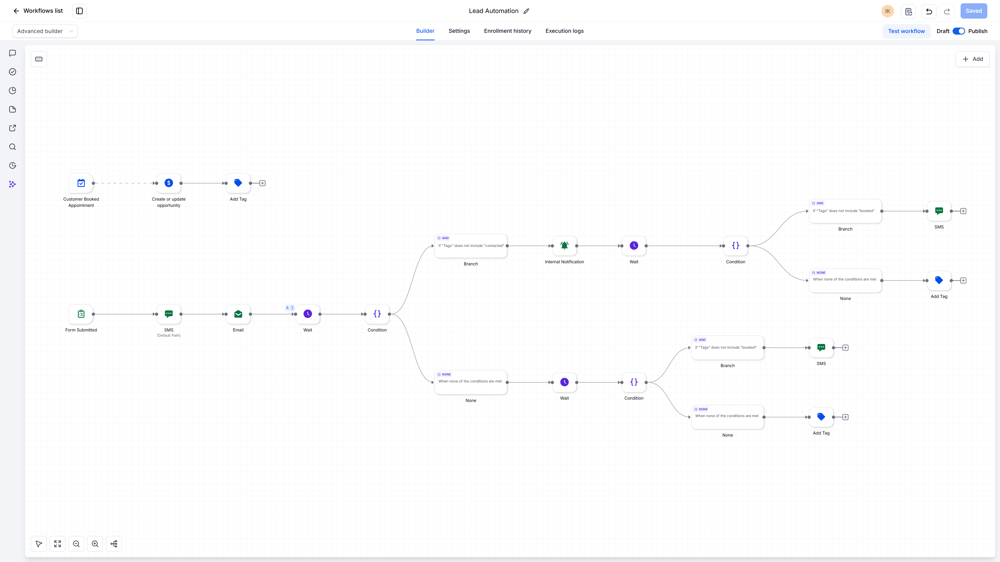
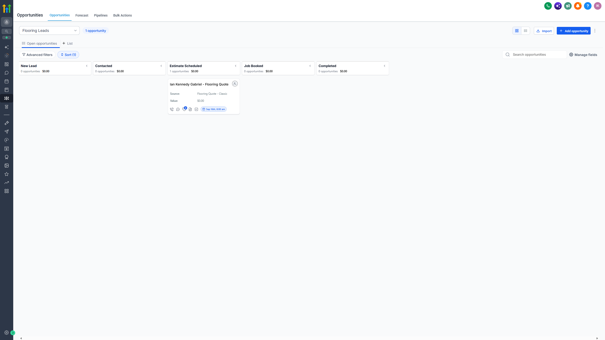

# Automated Lead Response

**Platform:** GoHighLevel  
**Tools:** GoHighLevel Workflows, Forms, Pipelines, SMS, Email, Internal Notification, Tags, Wait / Conditions

Follows up with new leads using tags and timed waits, from the first text message all the way to a booked appointment.

**Result:** No new lead waits on a person for their first reply

## Before

- A lead's first reply depended on someone being free to answer
- Leads who went quiet were easy to forget
- Booked appointments had to be moved on the pipeline by hand

## After

- Every form submission gets an instant text and email
- Quiet leads trigger a team alert, then a follow-up text if they stay quiet
- Booking an appointment updates the opportunity and the pipeline automatically

## How I built it

When someone fills out the form, they get a text and an email right away. The workflow then waits and checks for a Contacted tag. If the tag still isn't there, it alerts the team so someone can reach out personally. If the lead still hasn't booked after another wait, it sends one more text before letting them go. A separate trigger watches for booked appointments and creates or updates the opportunity, which moves the lead to Estimate Scheduled on the pipeline board. No AI here, just tags and wait steps.

## Screenshots

**Automation Workflow**

**Lead Capture Form**

**Pipeline Board**

## Files

GoHighLevel workflows can't be exported as a standalone file, so this build is documented with screenshots.

---

Built by Ian Kennedy Gabriel, IKG Digital. See the full portfolio at [ikgdigital.com](https://www.ikgdigital.com).
