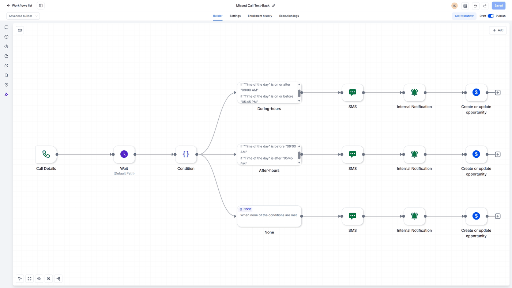

# Missed Call Text-Back

**Platform:** GoHighLevel  
**Tools:** GoHighLevel Workflows, SMS, Pipelines, Internal Notification, Conditions, Call Details

Texts back every missed call within moments, with different wording during and after business hours, and adds the caller to the pipeline as a new opportunity.

**Result:** Missed calls get a reply, whether it's midday or midnight

## Before

- A missed call got no response at all
- People who called after hours heard nothing until the next day
- There was no record of the call until someone followed up

## After

- Every missed call gets a text back within moments
- The message changes depending on whether the office is open
- The caller is added as an opportunity automatically

## How I built it

Unlike my other two GHL builds, this one branches on the time of day instead of tags. After a missed call, the workflow waits briefly, then a Condition step checks whether the call came in during business hours. Each branch sends its own text, creates the opportunity, and notifies the team. I also added a third branch for calls that don't match either condition, such as one that lands exactly on the cutoff time, so nothing falls through the gap.

## Screenshots

## Files

GoHighLevel workflows can't be exported as a standalone file, so this build is documented with screenshots.

---

Built by Ian Kennedy Gabriel, IKG Digital. See the full portfolio at [ikgdigital.com](https://www.ikgdigital.com).
