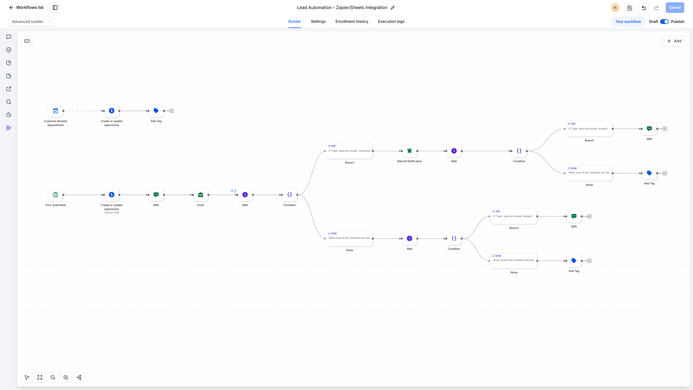
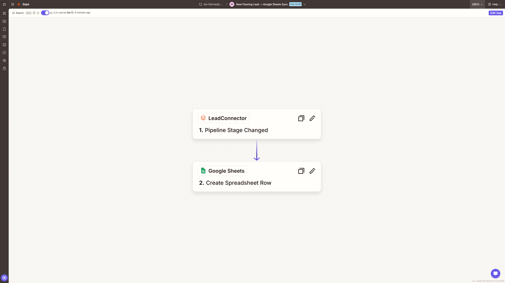
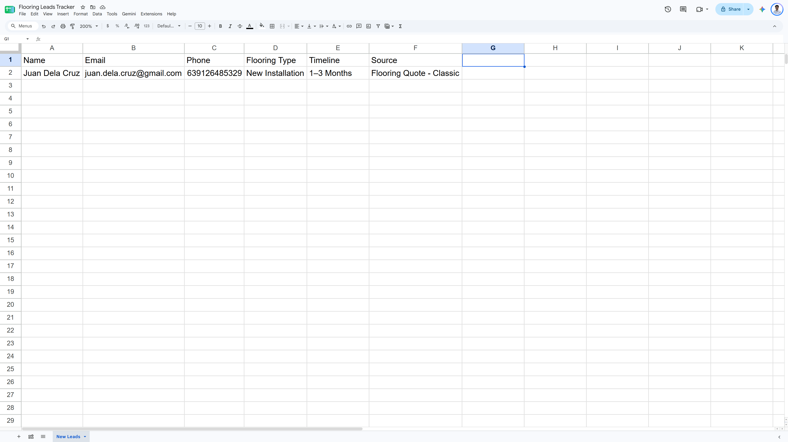

# Pipeline-to-Sheet Lead Sync

**Platform:** GoHighLevel  
**Tools:** Zapier, LeadConnector, Google Sheets, Pipeline Triggers

Watches for pipeline stage changes in GoHighLevel and writes the lead's details into a Google Sheet, so there's always an up-to-date copy outside the CRM.

**Result:** The CRM's lead data now has a live, shareable copy in Google Sheets

## Before

- Lead data only existed inside the CRM
- Checking pipeline progress meant logging into GoHighLevel
- Sharing leads with anyone else meant exporting or retyping them

## After

- Every stage change sends the lead's details to a live spreadsheet
- Anyone with the sheet link can see current leads without a GHL login
- Data is entered once in GHL, and the sheet stays in sync

## How I built it

This build is more about connecting two tools than complex logic. Zapier's LeadConnector trigger watches for a stage change in GoHighLevel, and a Google Sheets action adds the lead's details as a new row. I kept it to two steps with no branching, because the job is reliable syncing and nothing more. In practice, it means an owner can share leads with a subcontractor or a reporting sheet without handing out access to their CRM.

## Screenshots

**Lead Automation Workflow**

**Zapier Configuration**

**Flooring Leads Tracker**

## Files

GoHighLevel workflows can't be exported as a standalone file, so this build is documented with screenshots.

---

Built by Ian Kennedy Gabriel, IKG Digital. See the full portfolio at [ikgdigital.com](https://www.ikgdigital.com).
