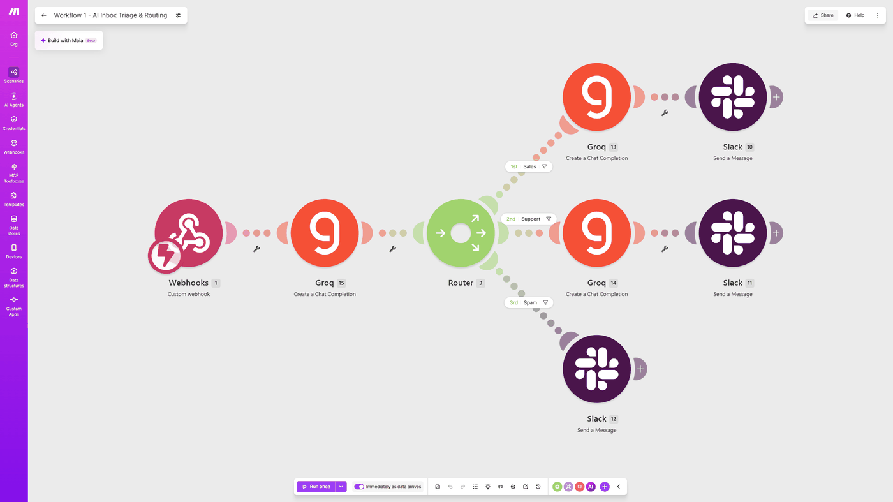

# AI Inbox Triage & Routing

**Platform:** Make  
**Tools:** Router, HTTP, Slack, Webhooks, Groq API, JSON

Reads every incoming message, labels it as Sales, Support, or Spam, then drafts a reply and posts it to the right Slack channel. Spam is filtered out before the reply step, so it never costs anything to process.

**Result:** Spam is filtered out before the AI writes anything, so it costs nothing to handle

## Before

- Every message had to be opened and read before anyone knew if it mattered
- Sales inquiries sat in the same pile as promotional spam
- There was no way to see how much of the AI budget went to messages that didn't need a reply

## After

- Each message is labeled the moment it arrives
- Only real inquiries get a drafted reply, and spam is simply logged
- One look at Slack shows what needs attention

## How I built it

Most of the running cost in a build like this comes from the AI calls, so I split the work into two steps. The first call only labels the message. The second call, which writes the reply, only runs for Sales and Support. Spam gets logged and stops there. On a quiet day that barely matters, but once message volume picks up, it means paying to draft replies for a fraction of the inbox instead of all of it.

## Screenshots

## Files

- `blueprint.json`: the exported Make scenario. In Make, create a new scenario, open the three-dot menu, choose **Import Blueprint**, and select this file. Webhook URLs, sheet IDs, and connections are replaced with placeholders, so you'll need to connect your own accounts.

---

Built by Ian Kennedy Gabriel, IKG Digital. See the full portfolio at [ikgdigital.com](https://www.ikgdigital.com).
