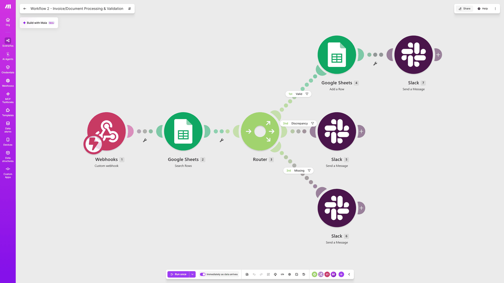

# Invoice/Document Processing & Validation

**Platform:** Make  
**Tools:** Google Sheets, Router, Filters, Webhooks, JSON

Checks each incoming invoice against a Google Sheet of purchase orders, then marks it as approved, flags a price mismatch, or reports a missing PO.

**Result:** A lookup that used to take a few minutes now happens instantly on every invoice

## Before

- Someone compared every invoice to its PO by hand
- Mismatches were only caught if someone happened to notice
- There was no record of what got approved or when

## After

- Every invoice is checked against the sheet as soon as it arrives
- Mismatches are flagged in Slack right away
- Approved invoices are logged automatically

## How I built it

There's no AI in this one, and that was on purpose. Matching an invoice to a PO is a lookup and a number comparison, and a Google Sheets search with a couple of filters handles that faster and for free. The part that took some testing was the invoice with no matching PO. Make doesn't treat an empty search result as an error, so without a separate check for it, those invoices would have slipped through without anyone being told.

## Screenshots

## Files

- `blueprint.json`: the exported Make scenario. In Make, create a new scenario, open the three-dot menu, choose **Import Blueprint**, and select this file. Webhook URLs, sheet IDs, and connections are replaced with placeholders, so you'll need to connect your own accounts.

---

Built by Ian Kennedy Gabriel, IKG Digital. See the full portfolio at [ikgdigital.com](https://www.ikgdigital.com).
