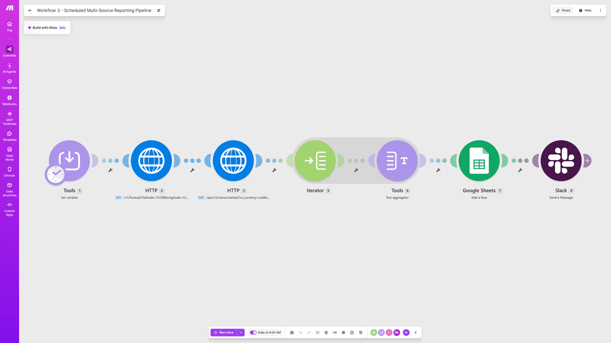

# Scheduled Multi-Source Reporting Pipeline

**Platform:** Make  
**Tools:** Iterator, Aggregator, Google Sheets, HTTP, Scheduling, Slack, Tools (Set Variable)

Runs every morning, pulls data from two public APIs, combines it into one summary, logs it to a Google Sheet, and posts a short digest in Slack.

**Result:** A daily manual check became a report that shows up on its own

## Before

- Checking two different websites by hand every morning
- No record of what the numbers looked like yesterday
- On a busy day, the check was easy to forget

## After

- Weather and crypto prices are pulled automatically at 9am
- Each day's numbers are logged, building a history over time
- A short digest lands in Slack without anyone asking for it

## How I built it

This project is where I used Make's Iterator and Aggregator, a pair of modules that confuses a lot of people at first. The crypto API returns three coins in a single response. The Iterator splits them into separate items, and the Aggregator joins them back into one block of text for the Slack message. I also picked two APIs that don't require an account or an API key, so the whole report runs without any subscription cost.

## Screenshots

## Files

- `blueprint.json`: the exported Make scenario. In Make, create a new scenario, open the three-dot menu, choose **Import Blueprint**, and select this file. Webhook URLs, sheet IDs, and connections are replaced with placeholders, so you'll need to connect your own accounts.

---

Built by Ian Kennedy Gabriel, IKG Digital. See the full portfolio at [ikgdigital.com](https://www.ikgdigital.com).
