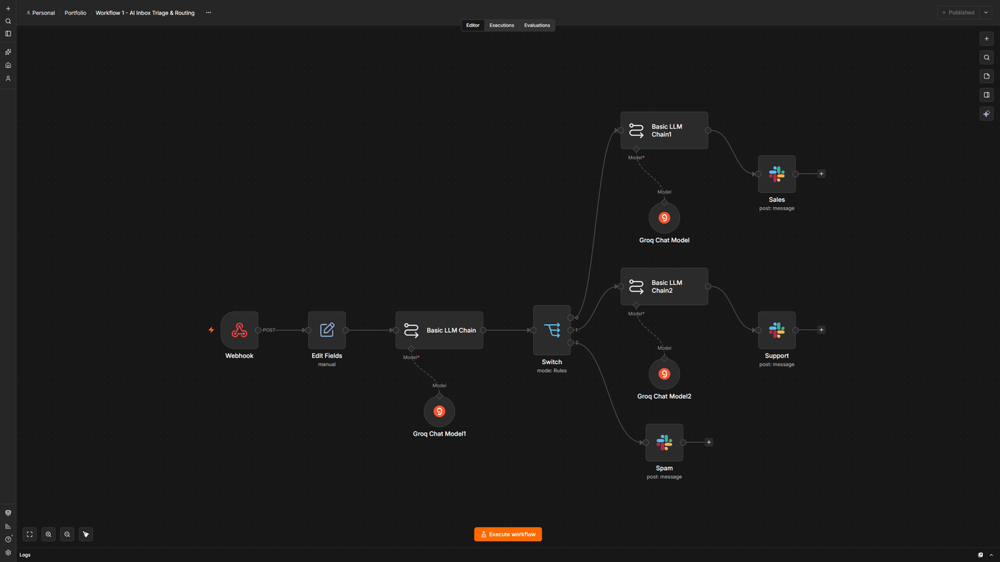

# AI Inbox Triage & Routing

**Platform:** n8n  
**Tools:** Webhook, Switch, Slack, Groq API, Edit Fields, JSON

The same labeling and routing idea as my Make version, rebuilt in n8n with a Switch node and its built-in Slack integration.

**Result:** Same cost split as the Make version: spam never reaches the reply step

## Before

- Every message had to be opened and read before anyone knew if it mattered
- Sales inquiries sat in the same pile as promotional spam
- There was no way to see how much of the AI budget went to messages that didn't need a reply

## After

- A Switch node sends each message down the right branch as soon as it arrives
- Only the Sales and Support branches generate a drafted reply
- Spam goes to Slack as a log entry, with no AI cost

## How I built it

n8n's Switch node works a lot like Make's Router, so the branching came together quickly. The tricky part was the data. Once the Groq request runs, its response replaces the original message data, so the sender, subject, and body are no longer in the current item. To use them further down the branch, I had to reference the earlier node by name. It's a small detail, but it's the kind of thing that breaks a first n8n build without an obvious error.

## Screenshots

## Files

- `workflow.json`: the exported n8n workflow. In n8n, create a new workflow, open the three-dot menu, choose **Import from File**, and select this file. Credentials and IDs are replaced with placeholders, so you'll need to connect your own accounts.

---

Built by Ian Kennedy Gabriel, IKG Digital. See the full portfolio at [ikgdigital.com](https://www.ikgdigital.com).
