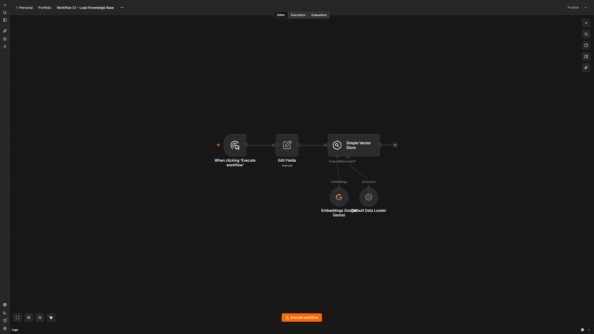
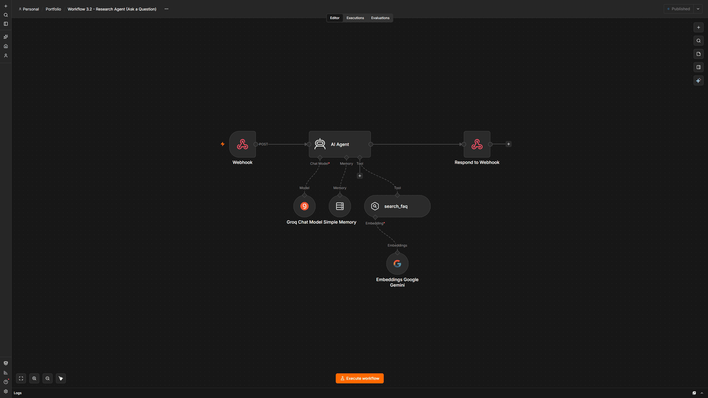

# AI Research Agent (RAG-grounded)

**Platform:** n8n  
**Tools:** AI Agent, Vector Store, Embeddings, Groq Chat Model, Google Gemini, Simple Memory, Webhook

An AI agent that searches a small knowledge base before it answers, says so when the answer isn't there, and remembers earlier questions within the same conversation.

**Result:** The agent admits when it doesn't know instead of making something up

## Before

- Getting an answer depended on someone who knew the FAQ well
- A general AI chatbot could give a confident answer that was simply wrong
- Each question started from scratch, with no memory of the conversation

## After

- Answers come from a knowledge base I loaded and control
- When the answer isn't covered, the agent says it doesn't know
- Follow-up questions build on what was asked earlier in the session

## How I built it

This is the most involved build in my portfolio. It uses n8n's AI Agent node with a vector store connected as a search tool, so the agent looks things up before it answers instead of relying on the model's general knowledge. The first thing I tested was a question the FAQ doesn't cover, to make sure it would admit that rather than invent an answer. That's the main reason to ground an agent in real documents. For memory, the webhook payload includes a session ID, since a webhook on its own has no way of knowing which conversation a new message belongs to.

## Screenshots

**Workflow 3.1: Load Knowledge Base**

**Workflow 3.2: Research Agent (Ask a Question)**

## Files

This build uses two workflows that work together. Import and run them in order:

- `1-load-knowledge-base.json`: loads the FAQ documents, turns them into embeddings, and stores them in the vector store. Run this one first.
- `2-research-agent.json`: the agent itself. It receives a question through a webhook, searches the vector store, and answers using what it finds, with memory tied to a session ID.

**Note on the vector store:** this build uses n8n's Simple Vector Store, which keeps the knowledge base in memory. It's quick to set up and free, but it's cleared whenever n8n restarts, so workflow 1 needs to be run again after each restart. For a production setup, I'd swap it for a persistent store such as Pinecone, Qdrant, or Supabase. Only the vector store node in each workflow would change.

In n8n, create a new workflow, open the three-dot menu, choose **Import from File**, and select each file. Credentials and IDs are replaced with placeholders, so you'll need to connect your own accounts.

---

Built by Ian Kennedy Gabriel, IKG Digital. See the full portfolio at [ikgdigital.com](https://www.ikgdigital.com).
