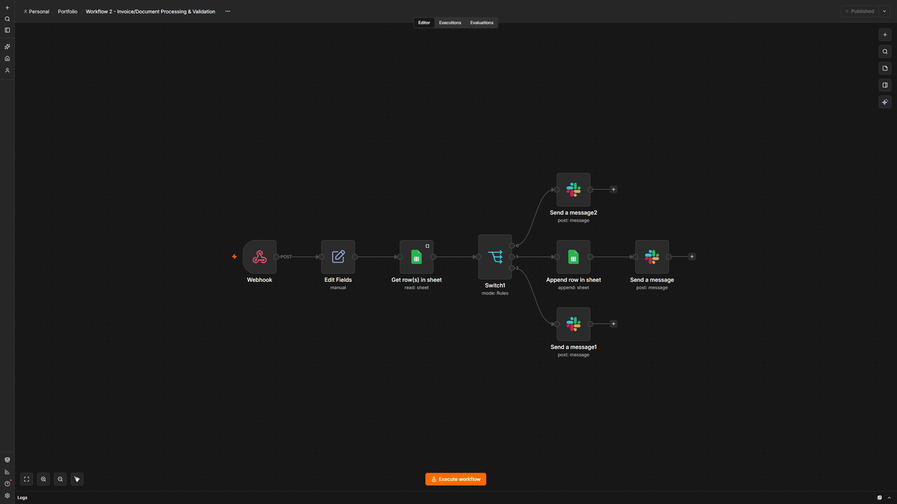

# Invoice/Document Processing & Validation

**Platform:** n8n  
**Tools:** Google Sheets, Switch, Slack, Webhook, Edit Fields

Looks up each invoice in a Google Sheet of purchase orders and sends it down a Valid, Discrepancy, or Missing branch, including the case where no PO exists at all.

**Result:** Invoices with no matching PO are caught and reported instead of quietly dropped

## Before

- Someone compared every invoice to its PO by hand
- Mismatches were only caught if someone happened to notice
- There was no record of what got approved or when

## After

- Every invoice is checked against the sheet as soon as it arrives
- Mismatches are flagged in Slack right away
- Invoices with no PO get their own branch instead of disappearing

## How I built it

n8n handles a failed lookup differently from Make and Zapier. When the Google Sheets node finds no match, it returns nothing at all, and the workflow simply stops. No error, no alert. I turned on the node's Always Output Data setting so that an empty result still moves forward and reaches the Missing branch. I only found this by testing an invoice that deliberately had no PO, which is why I now test the failure cases as carefully as the normal ones.

## Screenshots

## Files

- `workflow.json`: the exported n8n workflow. In n8n, create a new workflow, open the three-dot menu, choose **Import from File**, and select this file. Credentials and IDs are replaced with placeholders, so you'll need to connect your own accounts.

---

Built by Ian Kennedy Gabriel, IKG Digital. See the full portfolio at [ikgdigital.com](https://www.ikgdigital.com).
