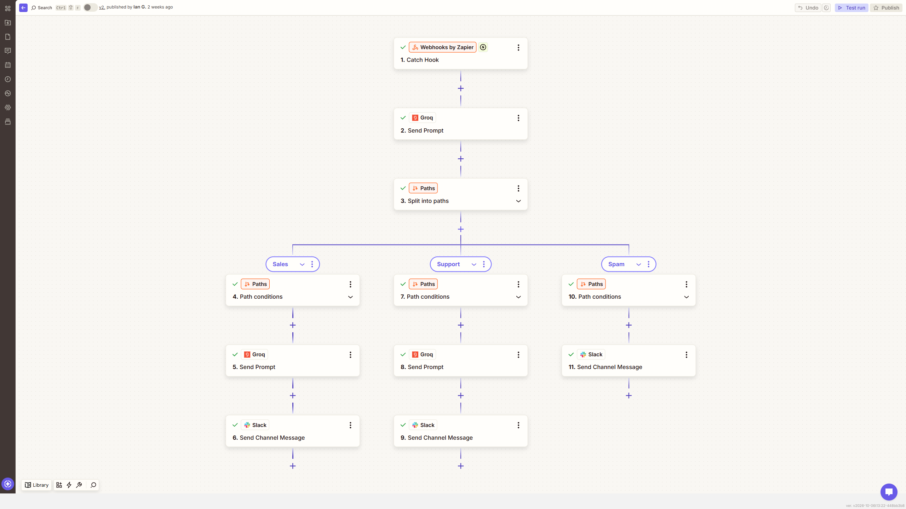

# AI Inbox Triage & Routing

**Platform:** Zapier  
**Tools:** Webhooks by Zapier, Paths, Slack, Custom Request, Groq API

Labels each incoming message as Sales, Support, or Spam, then uses Paths to draft a reply and alert the right Slack channel. Spam skips the reply step entirely.

**Result:** Same cost split as the other versions, built with Zapier's Paths

## Before

- Every message had to be opened and read before anyone knew if it mattered
- Sales inquiries sat in the same pile as promotional spam
- There was no way to see how much of the AI budget went to messages that didn't need a reply

## After

- Paths send each message down the right branch based on its label
- Only Sales and Support messages get a drafted reply
- Spam is logged without any AI cost

## How I built it

The biggest problem here came from the AI request itself. Zapier's standard Webhooks POST action can't send a nested JSON body properly, and it quietly breaks the arrays the Groq API expects. Switching to Custom Request fixed it, because it lets you paste the full JSON body as one block. Without that change, every request fails without a clear reason, and it's an easy trap to fall into the first time you connect Zapier to an API like this.

## Screenshots

## Files

Zapier doesn't export Zaps as a reusable file, so this build is documented with screenshots.

---

Built by Ian Kennedy Gabriel, IKG Digital. See the full portfolio at [ikgdigital.com](https://www.ikgdigital.com).
