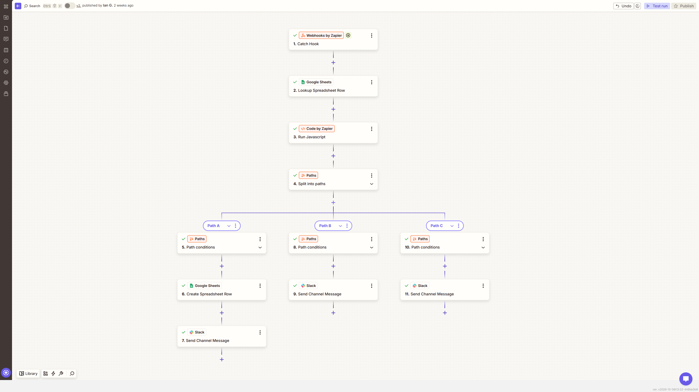

# Invoice/Document Processing & Validation

**Platform:** Zapier  
**Tools:** Google Sheets, Code by Zapier, Paths, Webhooks by Zapier

Checks each invoice against a Google Sheets record and routes it as approved, mismatched, or missing, using simple logic with no AI involved.

**Result:** No AI needed here. A lookup and a comparison handle the whole job

## Before

- Someone compared every invoice to its PO by hand
- Mismatches were only caught if someone happened to notice
- There was no record of what got approved or when

## After

- Every invoice is checked against the sheet as soon as it arrives
- Mismatches are flagged in Slack right away
- Approved invoices are logged automatically

## How I built it

This one runs on a Google Sheets lookup and Paths, with no code step needed for the comparison. The thing I paid attention to was the order of the Paths. The Missing path is checked first, because once you know the record exists, every later path can compare amounts without checking again. Putting it anywhere else would have meant repeating the same check in every branch.

## Screenshots

## Files

Zapier doesn't export Zaps as a reusable file, so this build is documented with screenshots.

---

Built by Ian Kennedy Gabriel, IKG Digital. See the full portfolio at [ikgdigital.com](https://www.ikgdigital.com).
