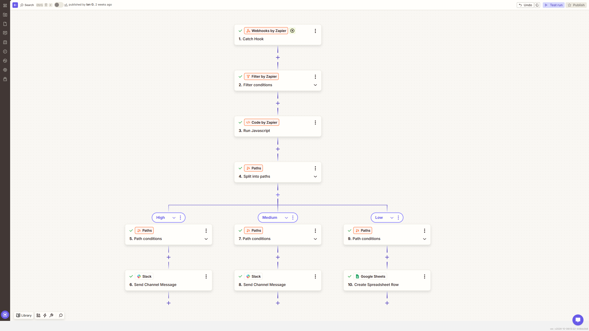

# Multi-Path Support Ticket Router

**Platform:** Zapier  
**Tools:** Filter, Code by Zapier, Paths, Webhooks by Zapier, Slack, Google Sheets

Filters out obvious noise, scores each remaining ticket for urgency and topic, and sends urgent issues to a different Slack channel than routine ones.

**Result:** Keyword rules handle all the sorting, with no AI model involved

## Before

- Every ticket was treated the same, urgent or not
- Unsubscribe requests and other noise still took up space in the queue
- Sorting by topic meant reading every ticket first

## After

- A Filter step removes obvious noise before anything else runs
- A short JavaScript step scores each ticket for priority and category
- Urgent tickets go to one Slack channel and routine ones go to another

## How I built it

I built this one to show that good routing doesn't always need AI. A Code by Zapier step checks each ticket against two keyword lists, one for urgency and one for topic, and uses the matches to set a priority and a category. Before that, a Filter step drops unsubscribe requests and similar noise. It's the least AI-heavy project here, and I included it on purpose, because knowing when plain logic is enough is part of the job. It's faster, it costs nothing to run, and it's easy to explain.

## Screenshots

## Files

Zapier doesn't export Zaps as a reusable file, so this build is documented with screenshots.

---

Built by Ian Kennedy Gabriel, IKG Digital. See the full portfolio at [ikgdigital.com](https://www.ikgdigital.com).
